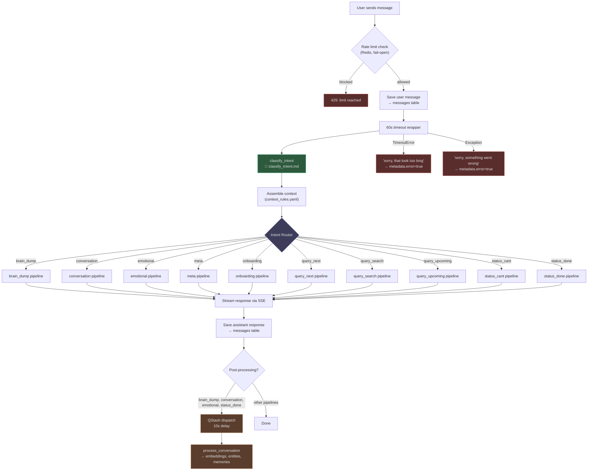

# Message Flow — Hot Path

Every user message follows this path. Click nodes to open source files.

```mermaid
flowchart TD
    MSG["User sends message"] --> GATE{"Rate limit check\n(Redis, fail-open)"}
    GATE -->|blocked| R429["429: limit reached"]
    GATE -->|allowed| SAVE_USER["Save user message\n→ messages table"]
    SAVE_USER --> TIMEOUT["60s timeout wrapper"]
    TIMEOUT --> CLASSIFY["classify_intent\n🤖 classify_intent.md"]
    CLASSIFY --> CTX["Assemble context\n(context_rules.yaml)"]
    CTX --> ROUTE{Intent Router}
    ROUTE -->|brain_dump| P_BRAIN_DUMP["brain_dump pipeline"]
    ROUTE -->|query_next| P_QUERY_NEXT["query_next pipeline"]
    ROUTE -->|query_search| P_QUERY_SEARCH["query_search pipeline"]
    ROUTE -->|query_upcoming| P_QUERY_UPCOMING["query_upcoming pipeline"]
    ROUTE -->|status_done| P_STATUS_DONE["status_done pipeline"]
    ROUTE -->|status_cant| P_STATUS_CANT["status_cant pipeline"]
    ROUTE -->|emotional| P_EMOTIONAL["emotional pipeline"]
    ROUTE -->|onboarding| P_ONBOARDING["onboarding pipeline"]
    ROUTE -->|meta| P_META["meta pipeline"]
    ROUTE -->|conversation| P_CONVERSATION["conversation pipeline"]
    P_BRAIN_DUMP --> STREAM
    P_CONVERSATION --> STREAM
    P_EMOTIONAL --> STREAM
    P_META --> STREAM
    P_ONBOARDING --> STREAM
    P_QUERY_NEXT --> STREAM
    P_QUERY_SEARCH --> STREAM
    P_QUERY_UPCOMING --> STREAM
    P_STATUS_CANT --> STREAM
    P_STATUS_DONE --> STREAM
    STREAM["Stream response via SSE"] --> SAVE_AI["Save assistant response\n→ messages table"]
    SAVE_AI --> POST{"Post-processing?"}
    POST -->|brain_dump, conversation, emotional, status_done| QSTASH["QStash dispatch\n10s delay"]
    POST -->|other pipelines| DONE["Done"]
    QSTASH --> PROC["process_conversation\n→ embeddings, entities, memories"]
    TIMEOUT -->|TimeoutError| ERR_TIMEOUT["'sorry, that took too long'\n→ metadata.error=true"]
    TIMEOUT -->|Exception| ERR_CRASH["'sorry, something went wrong'\n→ metadata.error=true"]
    style CLASSIFY fill:#2d5a3d,stroke:#5dcaa5,color:#e0e0e0
    style ROUTE fill:#3d3d5a,stroke:#8888cc,color:#e0e0e0
    style QSTASH fill:#5a3d2d,stroke:#cc8855,color:#e0e0e0
    style PROC fill:#5a3d2d,stroke:#cc8855,color:#e0e0e0
    style ERR_TIMEOUT fill:#5a2d2d,stroke:#cc5555,color:#e0e0e0
    style ERR_CRASH fill:#5a2d2d,stroke:#cc5555,color:#e0e0e0
    style R429 fill:#5a2d2d,stroke:#cc5555,color:#e0e0e0
    click CLASSIFY "backend/prompts/classify_intent.md"
    click CTX "backend/config/context_rules.yaml"
    click ROUTE "backend/config/intents.yaml"
    click QSTASH "backend/config/jobs.yaml"
    click P_BRAIN_DUMP "backend/config/pipelines/brain_dump.yaml"
    click P_CONVERSATION "backend/config/pipelines/conversation.yaml"
    click P_EMOTIONAL "backend/config/pipelines/emotional.yaml"
    click P_META "backend/config/pipelines/meta.yaml"
    click P_ONBOARDING "backend/config/pipelines/onboarding.yaml"
    click P_QUERY_NEXT "backend/config/pipelines/query_next.yaml"
    click P_QUERY_SEARCH "backend/config/pipelines/query_search.yaml"
    click P_QUERY_UPCOMING "backend/config/pipelines/query_upcoming.yaml"
    click P_STATUS_CANT "backend/config/pipelines/status_cant.yaml"
    click P_STATUS_DONE "backend/config/pipelines/status_done.yaml"
```
