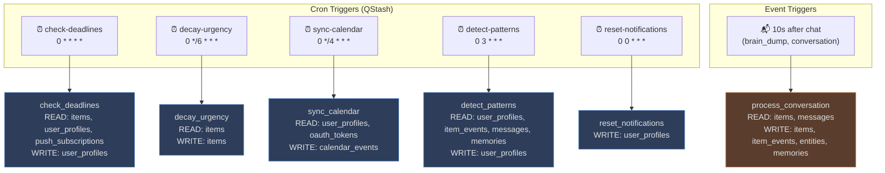

# Background Jobs

All jobs triggered by QStash cron or event dispatch.

```mermaid
flowchart TD
    subgraph cron["Cron Triggers (QStash)"]
        T0["⏰ check-deadlines\n0 * * * *"]
        T1["⏰ decay-urgency\n0 */6 * * *"]
        T2["⏰ sync-calendar\n0 */4 * * *"]
        T3["⏰ detect-patterns\n0 3 * * *"]
        T4["⏰ reset-notifications\n0 0 * * *"]
    end
    subgraph event["Event Triggers"]
        TE["📬 10s after chat\n(brain_dump, conversation)"]
    end
    T0 --> CHECK_DEADLINES["check_deadlines\nREAD: items, user_profiles, push_subscriptions\nWRITE: user_profiles"]
    style CHECK_DEADLINES fill:#2d3d5a,stroke:#5588cc,color:#e0e0e0
    click CHECK_DEADLINES "backend/src/jobs/check_deadlines.py"
    T1 --> DECAY_URGENCY["decay_urgency\nREAD: items\nWRITE: items"]
    style DECAY_URGENCY fill:#2d3d5a,stroke:#5588cc,color:#e0e0e0
    click DECAY_URGENCY "backend/src/jobs/decay_urgency.py"
    T2 --> SYNC_CALENDAR["sync_calendar\nREAD: user_profiles, oauth_tokens\nWRITE: calendar_events"]
    style SYNC_CALENDAR fill:#2d3d5a,stroke:#5588cc,color:#e0e0e0
    click SYNC_CALENDAR "backend/src/jobs/sync_calendar.py"
    T3 --> DETECT_PATTERNS["detect_patterns\nREAD: user_profiles, item_events, messages, memories\nWRITE: user_profiles"]
    style DETECT_PATTERNS fill:#2d3d5a,stroke:#5588cc,color:#e0e0e0
    click DETECT_PATTERNS "backend/src/jobs/detect_patterns.py"
    T4 --> RESET_NOTIFICATIONS["reset_notifications\nWRITE: user_profiles"]
    style RESET_NOTIFICATIONS fill:#2d3d5a,stroke:#5588cc,color:#e0e0e0
    click RESET_NOTIFICATIONS "backend/src/jobs/reset_notifications.py"
    TE --> PROC_CONV["process_conversation\nREAD: items, messages\nWRITE: items, item_events, entities, memories"]
    style PROC_CONV fill:#5a3d2d,stroke:#cc8855,color:#e0e0e0
    click PROC_CONV "backend/src/jobs/process_conversation.py"
```
