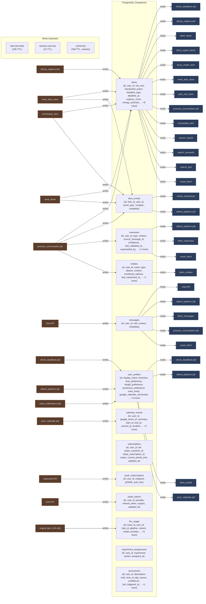

# Database Access Map

Tables and which tools/jobs read/write them.

```mermaid
flowchart LR
    subgraph postgres["PostgreSQL (Supabase)"]
        ITEMS["items\n(id, user_id, raw_text, interpreted_action, deadline_type, deadline_at, urgency_score, energy_estimate, ... +8 more)"]
        MESSAGES["messages\n(id, user_id, role, content, metadata)"]
        USER_PROFILES["user_profiles\n(id, display_name, timezone, tone_preference, length_preference, pushiness_preference, uses_emoji, google_calendar_connected, ... +3 more)"]
        ITEM_EVENTS["item_events\n(id, item_id, user_id, event_type, 'created',, metadata)"]
        MEMORIES["memories\n(id, user_id, type, content, source_message_id, confidence, last_validated_at, superseded_by, ... +2 more)"]
        ENTITIES["entities\n(id, user_id, name, type, aliases, context, emotional_valence, last_mentioned_at, ... +1 more)"]
        CALENDAR_EVENTS["calendar_events\n(id, user_id, google_event_id, summary, start_at, end_at, synced_at, location, ... +3 more)"]
        SUBSCRIPTIONS["subscriptions\n(id, user_id, tier, stripe_customer_id, stripe_subscription_id, status, current_period_end, updated_at)"]
        PUSH_SUBSCRIPTIONS["push_subscriptions\n(id, user_id, endpoint, p256dh, auth_key)"]
        OAUTH_TOKENS["oauth_tokens\n(id, user_id, provider, refresh_token, scopes, updated_at)"]
        LLM_USAGE["llm_usage\n(id, trace_id, user_id, step_id, pipeline, variant, model, provider, ... +5 more)"]
        EXPERIMENT_ASSIGNMENTS["experiment_assignments\n(id, user_id, experiment, variant, assigned_at)"]
        RECURRENCES["recurrences\n(id, user_id, description, rrule, time_of_day, source, confidence, last_triggered_at, ... +1 more)"]
    end
    subgraph redis["Redis (Upstash)"]
        REDIS_RATE["rate:user:date\n(24h TTL)"]
        REDIS_SESSION["session:user:key\n(1h TTL)"]
        REDIS_CACHE["cache:key\n(30d TTL, variants)"]
    end
    W_DECAY_URGENCY_JOB["decay_urgency job"] -->|writes| ITEMS
    style W_DECAY_URGENCY_JOB fill:#5a3d2d,stroke:#cc8855,color:#e0e0e0
    W_MARK_ITEM_DONE["mark_item_done"] -->|writes| ITEMS
    style W_MARK_ITEM_DONE fill:#5a3d2d,stroke:#cc8855,color:#e0e0e0
    W_PROCESS_CONVERSATION_JOB["process_conversation job"] -->|writes| ITEMS
    style W_PROCESS_CONVERSATION_JOB fill:#5a3d2d,stroke:#cc8855,color:#e0e0e0
    W_RESCHEDULE_ITEM["reschedule_item"] -->|writes| ITEMS
    style W_RESCHEDULE_ITEM fill:#5a3d2d,stroke:#cc8855,color:#e0e0e0
    W_SAVE_ITEMS["save_items"] -->|writes| ITEMS
    style W_SAVE_ITEMS fill:#5a3d2d,stroke:#cc8855,color:#e0e0e0
    W_CHAT_API["chat API"] -->|writes| MESSAGES
    style W_CHAT_API fill:#5a3d2d,stroke:#cc8855,color:#e0e0e0
    W_CHECK_DEADLINES_JOB["check_deadlines job"] -->|writes| USER_PROFILES
    style W_CHECK_DEADLINES_JOB fill:#5a3d2d,stroke:#cc8855,color:#e0e0e0
    W_DETECT_PATTERNS_JOB["detect_patterns job"] -->|writes| USER_PROFILES
    style W_DETECT_PATTERNS_JOB fill:#5a3d2d,stroke:#cc8855,color:#e0e0e0
    W_RESET_NOTIFICATIONS_JOB["reset_notifications job"] -->|writes| USER_PROFILES
    style W_RESET_NOTIFICATIONS_JOB fill:#5a3d2d,stroke:#cc8855,color:#e0e0e0
    W_MARK_ITEM_DONE["mark_item_done"] -->|writes| ITEM_EVENTS
    style W_MARK_ITEM_DONE fill:#5a3d2d,stroke:#cc8855,color:#e0e0e0
    W_PROCESS_CONVERSATION_JOB["process_conversation job"] -->|writes| ITEM_EVENTS
    style W_PROCESS_CONVERSATION_JOB fill:#5a3d2d,stroke:#cc8855,color:#e0e0e0
    W_RESCHEDULE_ITEM["reschedule_item"] -->|writes| ITEM_EVENTS
    style W_RESCHEDULE_ITEM fill:#5a3d2d,stroke:#cc8855,color:#e0e0e0
    W_SAVE_ITEMS["save_items"] -->|writes| ITEM_EVENTS
    style W_SAVE_ITEMS fill:#5a3d2d,stroke:#cc8855,color:#e0e0e0
    W_PROCESS_CONVERSATION_JOB["process_conversation job"] -->|writes| MEMORIES
    style W_PROCESS_CONVERSATION_JOB fill:#5a3d2d,stroke:#cc8855,color:#e0e0e0
    W_PROCESS_CONVERSATION_JOB["process_conversation job"] -->|writes| ENTITIES
    style W_PROCESS_CONVERSATION_JOB fill:#5a3d2d,stroke:#cc8855,color:#e0e0e0
    W_SYNC_CALENDAR_JOB["sync_calendar job"] -->|writes| CALENDAR_EVENTS
    style W_SYNC_CALENDAR_JOB fill:#5a3d2d,stroke:#cc8855,color:#e0e0e0
    W_SUBSCRIBE_API["subscribe API"] -->|writes| PUSH_SUBSCRIPTIONS
    style W_SUBSCRIBE_API fill:#5a3d2d,stroke:#cc8855,color:#e0e0e0
    W_AUTH_API["auth API"] -->|writes| OAUTH_TOKENS
    style W_AUTH_API fill:#5a3d2d,stroke:#cc8855,color:#e0e0e0
    W_ENGINE__PER_LLM_CALL_["engine (per LLM call)"] -->|writes| LLM_USAGE
    style W_ENGINE__PER_LLM_CALL_ fill:#5a3d2d,stroke:#cc8855,color:#e0e0e0
    ITEMS -->|reads| R_items_CHECK_DEADLINES_JOB["check_deadlines job"]
    style R_items_CHECK_DEADLINES_JOB fill:#2d3d5a,stroke:#5588cc,color:#e0e0e0
    ITEMS -->|reads| R_items_DECAY_URGENCY_JOB["decay_urgency job"]
    style R_items_DECAY_URGENCY_JOB fill:#2d3d5a,stroke:#5588cc,color:#e0e0e0
    ITEMS -->|reads| R_items_FETCH_ITEMS["fetch_items"]
    style R_items_FETCH_ITEMS fill:#2d3d5a,stroke:#5588cc,color:#e0e0e0
    ITEMS -->|reads| R_items_FETCH_URGENT_ITEMS["fetch_urgent_items"]
    style R_items_FETCH_URGENT_ITEMS fill:#2d3d5a,stroke:#5588cc,color:#e0e0e0
    ITEMS -->|reads| R_items_FUZZY_MATCH_ITEM["fuzzy_match_item"]
    style R_items_FUZZY_MATCH_ITEM fill:#2d3d5a,stroke:#5588cc,color:#e0e0e0
    ITEMS -->|reads| R_items_MARK_ITEM_DONE["mark_item_done"]
    style R_items_MARK_ITEM_DONE fill:#2d3d5a,stroke:#5588cc,color:#e0e0e0
    ITEMS -->|reads| R_items_PICK_NEXT_ITEM["pick_next_item"]
    style R_items_PICK_NEXT_ITEM fill:#2d3d5a,stroke:#5588cc,color:#e0e0e0
    ITEMS -->|reads| R_items_PROCESS_CONVERSATION_JOB["process_conversation job"]
    style R_items_PROCESS_CONVERSATION_JOB fill:#2d3d5a,stroke:#5588cc,color:#e0e0e0
    ITEMS -->|reads| R_items_RESCHEDULE_ITEM["reschedule_item"]
    style R_items_RESCHEDULE_ITEM fill:#2d3d5a,stroke:#5588cc,color:#e0e0e0
    ITEMS -->|reads| R_items_SEARCH_HYBRID["search_hybrid"]
    style R_items_SEARCH_HYBRID fill:#2d3d5a,stroke:#5588cc,color:#e0e0e0
    ITEMS -->|reads| R_items_SEARCH_SEMANTIC["search_semantic"]
    style R_items_SEARCH_SEMANTIC fill:#2d3d5a,stroke:#5588cc,color:#e0e0e0
    ITEMS -->|reads| R_items_SEARCH_TEXT["search_text"]
    style R_items_SEARCH_TEXT fill:#2d3d5a,stroke:#5588cc,color:#e0e0e0
    ITEMS -->|reads| R_items_SMART_FETCH["smart_fetch"]
    style R_items_SMART_FETCH fill:#2d3d5a,stroke:#5588cc,color:#e0e0e0
    MESSAGES -->|reads| R_messages_CHAT_API["chat API"]
    style R_messages_CHAT_API fill:#2d3d5a,stroke:#5588cc,color:#e0e0e0
    MESSAGES -->|reads| R_messages_DETECT_PATTERNS_JOB["detect_patterns job"]
    style R_messages_DETECT_PATTERNS_JOB fill:#2d3d5a,stroke:#5588cc,color:#e0e0e0
    MESSAGES -->|reads| R_messages_FETCH_MESSAGES["fetch_messages"]
    style R_messages_FETCH_MESSAGES fill:#2d3d5a,stroke:#5588cc,color:#e0e0e0
    MESSAGES -->|reads| R_messages_PROCESS_CONVERSATION_JOB["process_conversation job"]
    style R_messages_PROCESS_CONVERSATION_JOB fill:#2d3d5a,stroke:#5588cc,color:#e0e0e0
    MESSAGES -->|reads| R_messages_SMART_FETCH["smart_fetch"]
    style R_messages_SMART_FETCH fill:#2d3d5a,stroke:#5588cc,color:#e0e0e0
    USER_PROFILES -->|reads| R_user_profiles_CHECK_DEADLINES_JOB["check_deadlines job"]
    style R_user_profiles_CHECK_DEADLINES_JOB fill:#2d3d5a,stroke:#5588cc,color:#e0e0e0
    USER_PROFILES -->|reads| R_user_profiles_DETECT_PATTERNS_JOB["detect_patterns job"]
    style R_user_profiles_DETECT_PATTERNS_JOB fill:#2d3d5a,stroke:#5588cc,color:#e0e0e0
    USER_PROFILES -->|reads| R_user_profiles_FETCH_PROFILE["fetch_profile"]
    style R_user_profiles_FETCH_PROFILE fill:#2d3d5a,stroke:#5588cc,color:#e0e0e0
    USER_PROFILES -->|reads| R_user_profiles_SYNC_CALENDAR_JOB["sync_calendar job"]
    style R_user_profiles_SYNC_CALENDAR_JOB fill:#2d3d5a,stroke:#5588cc,color:#e0e0e0
    ITEM_EVENTS -->|reads| R_item_events_CHECK_MOMENTUM["check_momentum"]
    style R_item_events_CHECK_MOMENTUM fill:#2d3d5a,stroke:#5588cc,color:#e0e0e0
    ITEM_EVENTS -->|reads| R_item_events_DETECT_PATTERNS_JOB["detect_patterns job"]
    style R_item_events_DETECT_PATTERNS_JOB fill:#2d3d5a,stroke:#5588cc,color:#e0e0e0
    MEMORIES -->|reads| R_memories_DETECT_PATTERNS_JOB["detect_patterns job"]
    style R_memories_DETECT_PATTERNS_JOB fill:#2d3d5a,stroke:#5588cc,color:#e0e0e0
    MEMORIES -->|reads| R_memories_FETCH_MEMORIES["fetch_memories"]
    style R_memories_FETCH_MEMORIES fill:#2d3d5a,stroke:#5588cc,color:#e0e0e0
    MEMORIES -->|reads| R_memories_SMART_FETCH["smart_fetch"]
    style R_memories_SMART_FETCH fill:#2d3d5a,stroke:#5588cc,color:#e0e0e0
    ENTITIES -->|reads| R_entities_FETCH_ENTITIES["fetch_entities"]
    style R_entities_FETCH_ENTITIES fill:#2d3d5a,stroke:#5588cc,color:#e0e0e0
```
