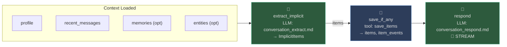

# Pipeline: conversation

General conversation

```mermaid
flowchart LR
    subgraph ctx["Context Loaded"]
        direction TB
        C0["profile"]
        C1["recent_messages"]
        C2["memories (opt)"]
        C3["entities (opt)"]
    end
    ctx --> EXTRACT_IMPLICIT
    EXTRACT_IMPLICIT["🤖\nextract_implicit\nLLM: conversation_extract.md\n→ ImplicitItems"]
    EXTRACT_IMPLICIT -->|items| SAVE_IF_ANY
    SAVE_IF_ANY["🔧\nsave_if_any\ntool: save_items\n→ items, item_events"]
    SAVE_IF_ANY --> RESPOND
    RESPOND["🤖\nrespond\nLLM: conversation_respond.md\n🔴 STREAM"]
    style EXTRACT_IMPLICIT fill:#2d5a3d,stroke:#5dcaa5,color:#e0e0e0
    style SAVE_IF_ANY fill:#2d3d5a,stroke:#5588cc,color:#e0e0e0
    style RESPOND fill:#2d5a3d,stroke:#5dcaa5,color:#e0e0e0
    click EXTRACT_IMPLICIT "backend/prompts/conversation_extract.md"
    click SAVE_IF_ANY "backend/src/tools/"
    click RESPOND "backend/prompts/conversation_respond.md"
```
