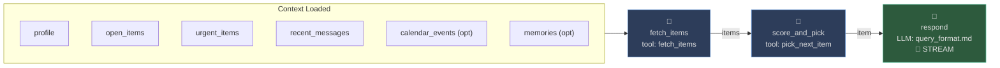

# Pipeline: query_next

User asks what to do next

```mermaid
flowchart LR
    subgraph ctx["Context Loaded"]
        direction TB
        C0["profile"]
        C1["open_items"]
        C2["urgent_items"]
        C3["recent_messages"]
        C4["calendar_events (opt)"]
        C5["memories (opt)"]
    end
    ctx --> FETCH_ITEMS
    FETCH_ITEMS["🔧\nfetch_items\ntool: fetch_items"]
    FETCH_ITEMS -->|items| SCORE_AND_PICK
    SCORE_AND_PICK["🔧\nscore_and_pick\ntool: pick_next_item"]
    SCORE_AND_PICK -->|item| RESPOND
    RESPOND["🤖\nrespond\nLLM: query_format.md\n🔴 STREAM"]
    style FETCH_ITEMS fill:#2d3d5a,stroke:#5588cc,color:#e0e0e0
    style SCORE_AND_PICK fill:#2d3d5a,stroke:#5588cc,color:#e0e0e0
    style RESPOND fill:#2d5a3d,stroke:#5dcaa5,color:#e0e0e0
    click FETCH_ITEMS "backend/src/tools/"
    click SCORE_AND_PICK "backend/src/tools/"
    click RESPOND "backend/prompts/query_format.md"
```
