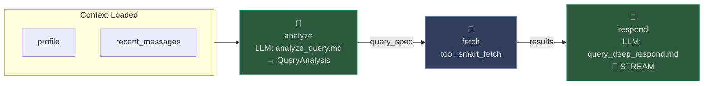

# Pipeline: query_search

User searches for something specific — analyzes the query, fetches targeted data, responds

```mermaid
flowchart LR
    subgraph ctx["Context Loaded"]
        direction TB
        C0["profile"]
        C1["recent_messages"]
    end
    ctx --> ANALYZE
    ANALYZE["🤖\nanalyze\nLLM: analyze_query.md\n→ QueryAnalysis"]
    ANALYZE -->|query_spec| FETCH
    FETCH["🔧\nfetch\ntool: smart_fetch"]
    FETCH -->|results| RESPOND
    RESPOND["🤖\nrespond\nLLM: query_deep_respond.md\n🔴 STREAM"]
    style ANALYZE fill:#2d5a3d,stroke:#5dcaa5,color:#e0e0e0
    style FETCH fill:#2d3d5a,stroke:#5588cc,color:#e0e0e0
    style RESPOND fill:#2d5a3d,stroke:#5dcaa5,color:#e0e0e0
    click ANALYZE "backend/prompts/analyze_query.md"
    click FETCH "backend/src/tools/"
    click RESPOND "backend/prompts/query_deep_respond.md"
```
