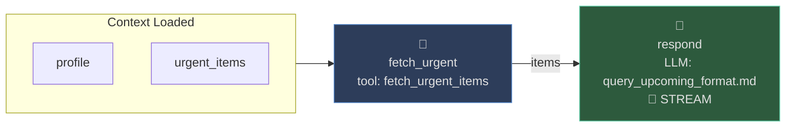

# Pipeline: query_upcoming

User asks about upcoming deadlines

```mermaid
flowchart LR
    subgraph ctx["Context Loaded"]
        direction TB
        C0["profile"]
        C1["urgent_items"]
    end
    ctx --> FETCH_URGENT
    FETCH_URGENT["🔧\nfetch_urgent\ntool: fetch_urgent_items"]
    FETCH_URGENT -->|items| RESPOND
    RESPOND["🤖\nrespond\nLLM: query_upcoming_format.md\n🔴 STREAM"]
    style FETCH_URGENT fill:#2d3d5a,stroke:#5588cc,color:#e0e0e0
    style RESPOND fill:#2d5a3d,stroke:#5dcaa5,color:#e0e0e0
    click FETCH_URGENT "backend/src/tools/"
    click RESPOND "backend/prompts/query_upcoming_format.md"
```
