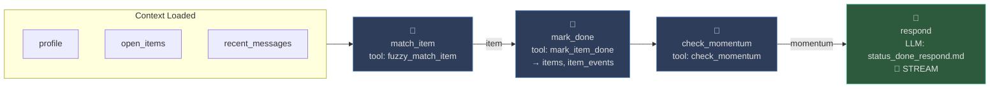

# Pipeline: status_done

User marks something as done

```mermaid
flowchart LR
    subgraph ctx["Context Loaded"]
        direction TB
        C0["profile"]
        C1["open_items"]
        C2["recent_messages"]
    end
    ctx --> MATCH_ITEM
    MATCH_ITEM["🔧\nmatch_item\ntool: fuzzy_match_item"]
    MATCH_ITEM -->|item| MARK_DONE
    MARK_DONE["🔧\nmark_done\ntool: mark_item_done\n→ items, item_events"]
    MARK_DONE --> CHECK_MOMENTUM
    CHECK_MOMENTUM["🔧\ncheck_momentum\ntool: check_momentum"]
    CHECK_MOMENTUM -->|momentum| RESPOND
    RESPOND["🤖\nrespond\nLLM: status_done_respond.md\n🔴 STREAM"]
    style MATCH_ITEM fill:#2d3d5a,stroke:#5588cc,color:#e0e0e0
    style MARK_DONE fill:#2d3d5a,stroke:#5588cc,color:#e0e0e0
    style CHECK_MOMENTUM fill:#2d3d5a,stroke:#5588cc,color:#e0e0e0
    style RESPOND fill:#2d5a3d,stroke:#5dcaa5,color:#e0e0e0
    click MATCH_ITEM "backend/src/tools/"
    click MARK_DONE "backend/src/tools/"
    click CHECK_MOMENTUM "backend/src/tools/"
    click RESPOND "backend/prompts/status_done_respond.md"
```
