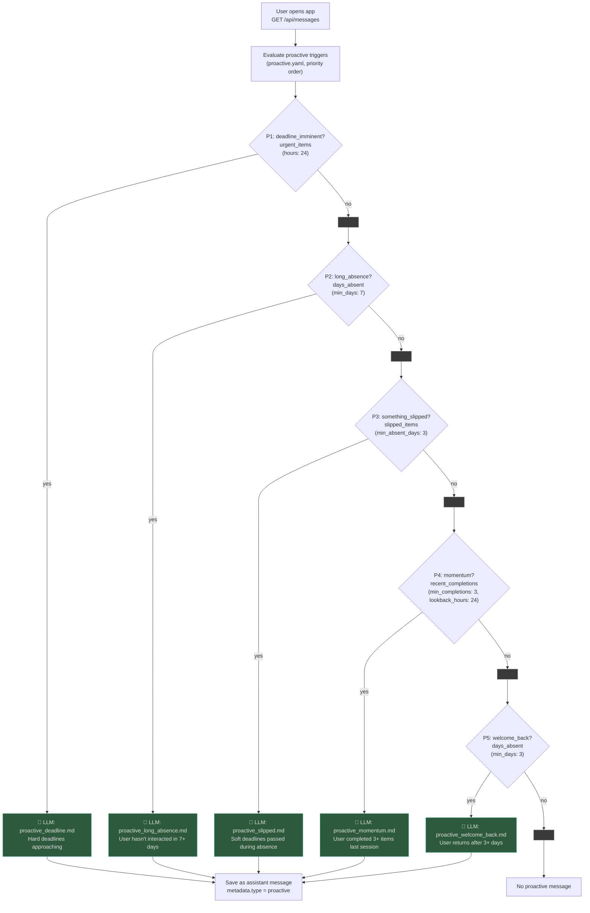

# Proactive Messages

Evaluated in priority order when user opens the app. First match fires.

```mermaid
flowchart TD
    OPEN["User opens app\nGET /api/messages"] --> EVAL["Evaluate proactive triggers\n(proactive.yaml, priority order)"]
    EVAL --> T0{"P1: deadline_imminent?\nurgent_items\n(hours: 24)"}
    T0 -->|yes| A0["🤖 LLM: proactive_deadline.md\nHard deadlines approaching"]
    style A0 fill:#2d5a3d,stroke:#5dcaa5,color:#e0e0e0
    click A0 "backend/prompts/proactive_deadline.md"
    A0 --> SAVE
    T0 -->|no| NEXT0[ ]
    style NEXT0 fill:#3a3a3a,stroke:#888888,color:#e0e0e0
    NEXT0 --> T1{"P2: long_absence?\ndays_absent\n(min_days: 7)"}
    T1 -->|yes| A1["🤖 LLM: proactive_long_absence.md\nUser hasn't interacted in 7+ days"]
    style A1 fill:#2d5a3d,stroke:#5dcaa5,color:#e0e0e0
    click A1 "backend/prompts/proactive_long_absence.md"
    A1 --> SAVE
    T1 -->|no| NEXT1[ ]
    style NEXT1 fill:#3a3a3a,stroke:#888888,color:#e0e0e0
    NEXT1 --> T2{"P3: something_slipped?\nslipped_items\n(min_absent_days: 3)"}
    T2 -->|yes| A2["🤖 LLM: proactive_slipped.md\nSoft deadlines passed during absence"]
    style A2 fill:#2d5a3d,stroke:#5dcaa5,color:#e0e0e0
    click A2 "backend/prompts/proactive_slipped.md"
    A2 --> SAVE
    T2 -->|no| NEXT2[ ]
    style NEXT2 fill:#3a3a3a,stroke:#888888,color:#e0e0e0
    NEXT2 --> T3{"P4: momentum?\nrecent_completions\n(min_completions: 3, lookback_hours: 24)"}
    T3 -->|yes| A3["🤖 LLM: proactive_momentum.md\nUser completed 3+ items last session"]
    style A3 fill:#2d5a3d,stroke:#5dcaa5,color:#e0e0e0
    click A3 "backend/prompts/proactive_momentum.md"
    A3 --> SAVE
    T3 -->|no| NEXT3[ ]
    style NEXT3 fill:#3a3a3a,stroke:#888888,color:#e0e0e0
    NEXT3 --> T4{"P5: welcome_back?\ndays_absent\n(min_days: 3)"}
    T4 -->|yes| A4["🤖 LLM: proactive_welcome_back.md\nUser returns after 3+ days"]
    style A4 fill:#2d5a3d,stroke:#5dcaa5,color:#e0e0e0
    click A4 "backend/prompts/proactive_welcome_back.md"
    A4 --> SAVE
    T4 -->|no| NEXT4[ ]
    style NEXT4 fill:#3a3a3a,stroke:#888888,color:#e0e0e0
    NEXT4 --> NONE["No proactive message"]
    SAVE["Save as assistant message\nmetadata.type = proactive"]
    click EVAL "backend/config/proactive.yaml"
```
