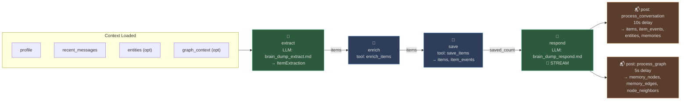

# Pipeline: brain_dump

Process a brain dump — extract items, enrich, save, respond naturally

Green = LLM call, Blue = tool call, Orange = async post-processing.

```mermaid
flowchart LR
    subgraph ctx["Context Loaded"]
        direction TB
        C0["profile"]
        C1["recent_messages"]
        C2["entities (opt)"]
        C3["graph_context (opt)"]
    end
    ctx --> EXTRACT
    EXTRACT["🤖\nextract\nLLM: brain_dump_extract.md\n→ ItemExtraction"]
    EXTRACT -->|items| ENRICH
    ENRICH["🔧\nenrich\ntool: enrich_items"]
    ENRICH -->|items| SAVE
    SAVE["🔧\nsave\ntool: save_items\n→ items, item_events"]
    SAVE -->|saved_count| RESPOND
    RESPOND["🤖\nrespond\nLLM: brain_dump_respond.md\n🔴 STREAM"]
    RESPOND --> PP_PROCESS_CONVERSATION["📬 post: process_conversation\n10s delay\n→ items, item_events, entities, memories"]
    RESPOND --> PP_PROCESS_GRAPH["📬 post: process_graph\n5s delay\n→ memory_nodes, memory_edges, node_neighbors"]
    style EXTRACT fill:#2d5a3d,stroke:#5dcaa5,color:#e0e0e0
    style ENRICH fill:#2d3d5a,stroke:#5588cc,color:#e0e0e0
    style SAVE fill:#2d3d5a,stroke:#5588cc,color:#e0e0e0
    style RESPOND fill:#2d5a3d,stroke:#5dcaa5,color:#e0e0e0
    style PP_PROCESS_CONVERSATION fill:#5a3d2d,stroke:#cc8855,color:#e0e0e0
    style PP_PROCESS_GRAPH fill:#5a3d2d,stroke:#cc8855,color:#e0e0e0
    click EXTRACT "backend/prompts/brain_dump_extract.md"
    click ENRICH "backend/src/tools/"
    click SAVE "backend/src/tools/"
    click RESPOND "backend/prompts/brain_dump_respond.md"
    click PP_PROCESS_CONVERSATION "backend/config/jobs.yaml"
    click PP_PROCESS_GRAPH "backend/config/jobs.yaml"
```
