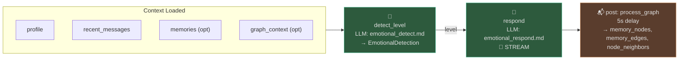

# Pipeline: emotional

User expressing emotions

Green = LLM call, Blue = tool call, Orange = async post-processing.

```mermaid
flowchart LR
    subgraph ctx["Context Loaded"]
        direction TB
        C0["profile"]
        C1["recent_messages"]
        C2["memories (opt)"]
        C3["graph_context (opt)"]
    end
    ctx --> DETECT_LEVEL
    DETECT_LEVEL["🤖\ndetect_level\nLLM: emotional_detect.md\n→ EmotionalDetection"]
    DETECT_LEVEL -->|level| RESPOND
    RESPOND["🤖\nrespond\nLLM: emotional_respond.md\n🔴 STREAM"]
    RESPOND --> PP_PROCESS_GRAPH["📬 post: process_graph\n5s delay\n→ memory_nodes, memory_edges, node_neighbors"]
    style DETECT_LEVEL fill:#2d5a3d,stroke:#5dcaa5,color:#e0e0e0
    style RESPOND fill:#2d5a3d,stroke:#5dcaa5,color:#e0e0e0
    style PP_PROCESS_GRAPH fill:#5a3d2d,stroke:#cc8855,color:#e0e0e0
    click DETECT_LEVEL "backend/prompts/emotional_detect.md"
    click RESPOND "backend/prompts/emotional_respond.md"
    click PP_PROCESS_GRAPH "backend/config/jobs.yaml"
```
