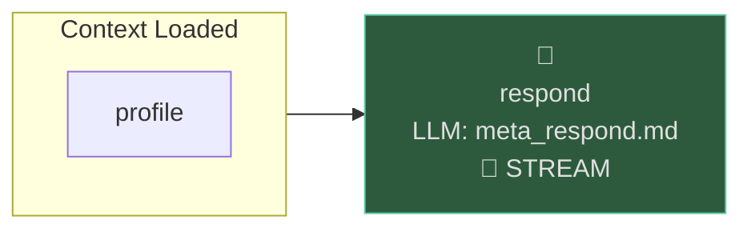

# Pipeline: meta

User asks about the app itself

Green = LLM call, Blue = tool call, Orange = async post-processing.

```mermaid
flowchart LR
    subgraph ctx["Context Loaded"]
        direction TB
        C0["profile"]
    end
    ctx --> RESPOND
    RESPOND["🤖\nrespond\nLLM: meta_respond.md\n🔴 STREAM"]
    style RESPOND fill:#2d5a3d,stroke:#5dcaa5,color:#e0e0e0
    click RESPOND "backend/prompts/meta_respond.md"
```
