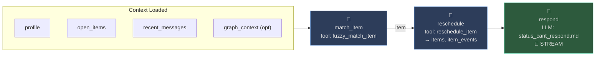

# Pipeline: status_cant

User can't do something

Green = LLM call, Blue = tool call, Orange = async post-processing.

```mermaid
flowchart LR
    subgraph ctx["Context Loaded"]
        direction TB
        C0["profile"]
        C1["open_items"]
        C2["recent_messages"]
        C3["graph_context (opt)"]
    end
    ctx --> MATCH_ITEM
    MATCH_ITEM["🔧\nmatch_item\ntool: fuzzy_match_item"]
    MATCH_ITEM -->|item| RESCHEDULE
    RESCHEDULE["🔧\nreschedule\ntool: reschedule_item\n→ items, item_events"]
    RESCHEDULE --> RESPOND
    RESPOND["🤖\nrespond\nLLM: status_cant_respond.md\n🔴 STREAM"]
    style MATCH_ITEM fill:#2d3d5a,stroke:#5588cc,color:#e0e0e0
    style RESCHEDULE fill:#2d3d5a,stroke:#5588cc,color:#e0e0e0
    style RESPOND fill:#2d5a3d,stroke:#5dcaa5,color:#e0e0e0
    click MATCH_ITEM "backend/src/tools/"
    click RESCHEDULE "backend/src/tools/"
    click RESPOND "backend/prompts/status_cant_respond.md"
```
