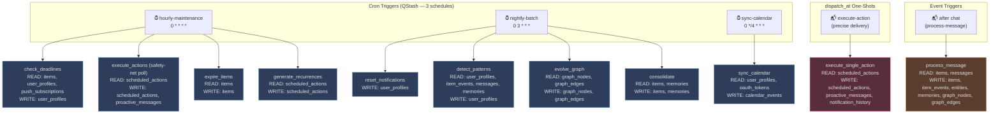

# Background Jobs — Cold Path

All jobs triggered by QStash cron or event dispatch. Cron jobs are consolidated into 3 schedules to stay within QStash free tier limits.

```mermaid
flowchart TD
    subgraph cron["Cron Triggers (QStash — 3 schedules)"]
        T0["⏰ hourly-maintenance\n0 * * * *"]
        T1["⏰ nightly-batch\n0 3 * * *"]
        T2["⏰ sync-calendar\n0 */4 * * *"]
    end
    subgraph dispatch["dispatch_at One-Shots"]
        TD["📬 execute-action\n(precise delivery)"]
    end
    subgraph event["Event Triggers"]
        TE["📬 after chat\n(process-message)"]
    end
    T0 --> CHECK_DEADLINES["check_deadlines\nREAD: items, user_profiles, push_subscriptions\nWRITE: user_profiles"]
    style CHECK_DEADLINES fill:#2d3d5a,stroke:#5588cc,color:#e0e0e0
    click CHECK_DEADLINES "backend/src/jobs/check_deadlines.py"
    T0 --> EXECUTE_ACTIONS["execute_actions (safety-net poll)\nREAD: scheduled_actions\nWRITE: scheduled_actions, proactive_messages"]
    style EXECUTE_ACTIONS fill:#2d3d5a,stroke:#5588cc,color:#e0e0e0
    click EXECUTE_ACTIONS "backend/src/jobs/execute_actions.py"
    T0 --> EXPIRE_ITEMS["expire_items\nREAD: items\nWRITE: items"]
    style EXPIRE_ITEMS fill:#2d3d5a,stroke:#5588cc,color:#e0e0e0
    click EXPIRE_ITEMS "backend/src/jobs/expire_items.py"
    T0 --> GEN_RECURRENCES["generate_recurrences\nREAD: scheduled_actions\nWRITE: scheduled_actions"]
    style GEN_RECURRENCES fill:#2d3d5a,stroke:#5588cc,color:#e0e0e0
    click GEN_RECURRENCES "backend/src/jobs/generate_recurrences.py"
    T1 --> RESET_NOTIFICATIONS["reset_notifications\nWRITE: user_profiles"]
    style RESET_NOTIFICATIONS fill:#2d3d5a,stroke:#5588cc,color:#e0e0e0
    click RESET_NOTIFICATIONS "backend/src/jobs/reset_notifications.py"
    T1 --> DETECT_PATTERNS["detect_patterns\nREAD: user_profiles, item_events, messages, memories\nWRITE: user_profiles"]
    style DETECT_PATTERNS fill:#2d3d5a,stroke:#5588cc,color:#e0e0e0
    click DETECT_PATTERNS "backend/src/jobs/detect_patterns.py"
    T1 --> EVOLVE_GRAPH["evolve_graph\nREAD: graph_nodes, graph_edges\nWRITE: graph_nodes, graph_edges"]
    style EVOLVE_GRAPH fill:#2d3d5a,stroke:#5588cc,color:#e0e0e0
    click EVOLVE_GRAPH "backend/src/jobs/evolve_graph.py"
    T1 --> CONSOLIDATE["consolidate\nREAD: items, memories\nWRITE: items, memories"]
    style CONSOLIDATE fill:#2d3d5a,stroke:#5588cc,color:#e0e0e0
    click CONSOLIDATE "backend/src/jobs/consolidate.py"
    T2 --> SYNC_CALENDAR["sync_calendar\nREAD: user_profiles, oauth_tokens\nWRITE: calendar_events"]
    style SYNC_CALENDAR fill:#2d3d5a,stroke:#5588cc,color:#e0e0e0
    click SYNC_CALENDAR "backend/src/jobs/sync_calendar.py"
    TD --> EXECUTE_ACTION["execute_single_action\nREAD: scheduled_actions\nWRITE: scheduled_actions, proactive_messages, notification_history"]
    style EXECUTE_ACTION fill:#5a2d3d,stroke:#cc5588,color:#e0e0e0
    click EXECUTE_ACTION "backend/src/jobs/execute_actions.py"
    TE --> PROC_MSG["process_message\nREAD: items, messages\nWRITE: items, item_events, entities, memories, graph_nodes, graph_edges"]
    style PROC_MSG fill:#5a3d2d,stroke:#cc8855,color:#e0e0e0
    click PROC_MSG "backend/src/jobs/process_message.py"
```
