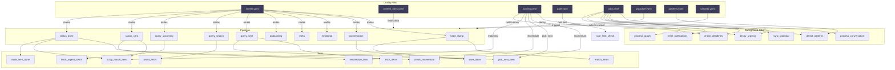

# Config Dependencies

Shows which config files affect which pipelines, tools, and jobs.

```mermaid
flowchart TD
    subgraph configs["Config Files"]
        INTENTS["intents.yaml"]
        style INTENTS fill:#3d3d5a,stroke:#8888cc,color:#e0e0e0
        click INTENTS "backend/config/intents.yaml"
        CONTEXT["context_rules.yaml"]
        style CONTEXT fill:#3d3d5a,stroke:#8888cc,color:#e0e0e0
        click CONTEXT "backend/config/context_rules.yaml"
        SCORING["scoring.yaml"]
        style SCORING fill:#3d3d5a,stroke:#8888cc,color:#e0e0e0
        click SCORING "backend/config/scoring.yaml"
        GATE["gate.yaml"]
        style GATE fill:#3d3d5a,stroke:#8888cc,color:#e0e0e0
        click GATE "backend/config/gate.yaml"
        JOBS["jobs.yaml"]
        style JOBS fill:#3d3d5a,stroke:#8888cc,color:#e0e0e0
        click JOBS "backend/config/jobs.yaml"
        PROACTIVE["proactive.yaml"]
        style PROACTIVE fill:#3d3d5a,stroke:#8888cc,color:#e0e0e0
        click PROACTIVE "backend/config/proactive.yaml"
        PATTERNS["patterns.yaml"]
        style PATTERNS fill:#3d3d5a,stroke:#8888cc,color:#e0e0e0
        click PATTERNS "backend/config/patterns.yaml"
        VARIANTS["variants.yaml"]
        style VARIANTS fill:#3d3d5a,stroke:#8888cc,color:#e0e0e0
        click VARIANTS "backend/config/variants.yaml"
    end
    subgraph pipelines["Pipelines"]
        P_BRAIN_DUMP["brain_dump"]
        click P_BRAIN_DUMP "backend/config/pipelines/brain_dump.yaml"
        P_CONVERSATION["conversation"]
        click P_CONVERSATION "backend/config/pipelines/conversation.yaml"
        P_EMOTIONAL["emotional"]
        click P_EMOTIONAL "backend/config/pipelines/emotional.yaml"
        P_META["meta"]
        click P_META "backend/config/pipelines/meta.yaml"
        P_ONBOARDING["onboarding"]
        click P_ONBOARDING "backend/config/pipelines/onboarding.yaml"
        P_QUERY_NEXT["query_next"]
        click P_QUERY_NEXT "backend/config/pipelines/query_next.yaml"
        P_QUERY_SEARCH["query_search"]
        click P_QUERY_SEARCH "backend/config/pipelines/query_search.yaml"
        P_QUERY_UPCOMING["query_upcoming"]
        click P_QUERY_UPCOMING "backend/config/pipelines/query_upcoming.yaml"
        P_STATUS_CANT["status_cant"]
        click P_STATUS_CANT "backend/config/pipelines/status_cant.yaml"
        P_STATUS_DONE["status_done"]
        click P_STATUS_DONE "backend/config/pipelines/status_done.yaml"
    end
    subgraph tools["Tools"]
        TOOL_CHECK_MOMENTUM["check_momentum"]
        TOOL_ENRICH_ITEMS["enrich_items"]
        TOOL_FETCH_ITEMS["fetch_items"]
        TOOL_FETCH_URGENT_ITEMS["fetch_urgent_items"]
        TOOL_FUZZY_MATCH_ITEM["fuzzy_match_item"]
        TOOL_MARK_ITEM_DONE["mark_item_done"]
        TOOL_PICK_NEXT_ITEM["pick_next_item"]
        TOOL_RESCHEDULE_ITEM["reschedule_item"]
        TOOL_SAVE_ITEMS["save_items"]
        TOOL_SMART_FETCH["smart_fetch"]
    end
    subgraph jobs["Background Jobs"]
        JOB_PROCESS_CONVERSATION["process_conversation"]
        JOB_DECAY_URGENCY["decay_urgency"]
        JOB_CHECK_DEADLINES["check_deadlines"]
        JOB_SYNC_CALENDAR["sync_calendar"]
        JOB_DETECT_PATTERNS["detect_patterns"]
        JOB_RESET_NOTIFICATIONS["reset_notifications"]
        JOB_PROCESS_GRAPH["process_graph"]
    end
    INTENTS -->|routes| P_BRAIN_DUMP
    INTENTS -->|routes| P_CONVERSATION
    INTENTS -->|routes| P_EMOTIONAL
    INTENTS -->|routes| P_META
    INTENTS -->|routes| P_ONBOARDING
    INTENTS -->|routes| P_QUERY_NEXT
    INTENTS -->|routes| P_QUERY_SEARCH
    INTENTS -->|routes| P_QUERY_UPCOMING
    INTENTS -->|routes| P_STATUS_CANT
    INTENTS -->|routes| P_STATUS_DONE
    CONTEXT -->|loads data| pipelines
    P_STATUS_DONE --> TOOL_CHECK_MOMENTUM
    P_BRAIN_DUMP --> TOOL_ENRICH_ITEMS
    P_QUERY_NEXT --> TOOL_FETCH_ITEMS
    P_QUERY_UPCOMING --> TOOL_FETCH_URGENT_ITEMS
    P_STATUS_CANT --> TOOL_FUZZY_MATCH_ITEM
    P_STATUS_DONE --> TOOL_FUZZY_MATCH_ITEM
    P_STATUS_DONE --> TOOL_MARK_ITEM_DONE
    P_QUERY_NEXT --> TOOL_PICK_NEXT_ITEM
    P_STATUS_CANT --> TOOL_RESCHEDULE_ITEM
    P_BRAIN_DUMP --> TOOL_SAVE_ITEMS
    P_CONVERSATION --> TOOL_SAVE_ITEMS
    P_QUERY_SEARCH --> TOOL_SMART_FETCH
    SCORING -->|decay| JOB_DECAY_URGENCY
    SCORING -->|momentum| TOOL_CHECK_MOMENTUM
    SCORING -->|pick_next| TOOL_PICK_NEXT_ITEM
    SCORING -->|reschedule| TOOL_RESCHEDULE_ITEM
    SCORING -->|matching| TOOL_FUZZY_MATCH_ITEM
    SCORING -->|notifications| JOB_CHECK_DEADLINES
    JOBS --> JOB_PROCESS_CONVERSATION
    JOBS --> JOB_DECAY_URGENCY
    JOBS --> JOB_CHECK_DEADLINES
    JOBS --> JOB_SYNC_CALENDAR
    JOBS --> JOB_DETECT_PATTERNS
    JOBS --> JOB_RESET_NOTIFICATIONS
    JOBS --> JOB_PROCESS_GRAPH
    PATTERNS --> JOB_DETECT_PATTERNS
    PROACTIVE -->|triggers| pipelines
    VARIANTS -->|selects variant| pipelines
    GATE -->|rate limit| GATE_CHECK["rate_limit_check"]
```
